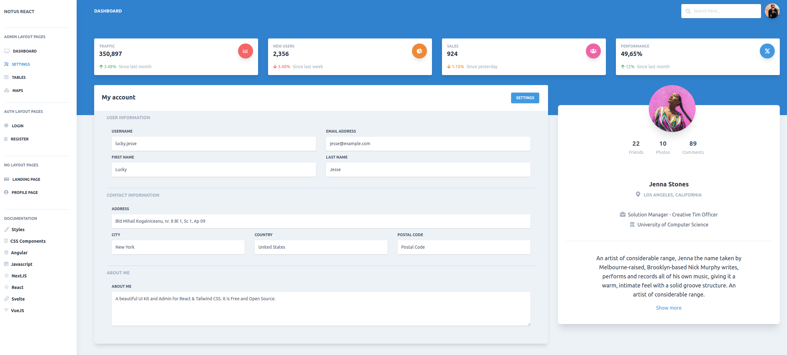

# Pixeon Quality Assurance Analyst Challenge

Esse desafio tem por objetivo avaliar sua capacidade de criar cenários de testes e de automatizá-los.

Queremos entender como você pensa e também o que conhece sobre o mundo da automação de testes, para isso você poderá utilizar a stack que julgar apropriada.

Mantenha em mente que outros analistas irão acessar a sua solução, então é importante criar uma documentação que nos ajude a rodar o seu projeto. Além disso, esperamos que você nos disponibilize a solução em um repositorio Git. 

Iremos avaliar os seguintes itens:

- A estruturação e escrita dos cenários de testes;
- Os cenários e validações das automações;
- A utilização de padrões de projetos;
- A estruturação do projeto;
- Boas práticas de programação;

# Desafio

O desafio está dividido em três partes

1. Especificar cenários de testes;
2. Automatizar o teste front-end;
3. Automatizar o teste back-end de uma API Rest;

## 1 - Cenários de Testes

Neste item esperamos que voê crie cenários de testes baseados na imagem abaixo.

Sinta-se livre para utilizar o formato que desejar, mas recomendamos formtemente que utilize Gherkin. Você consegue encontrar um demo dessa aplicação em [Demo](https://demos.creative-tim.com/notus-react/?_ga=2.154140984.1600938269.1610986568-1695319199.1610986568#/admin/settings)

## 2 - Automação de front-end

No site [Frontend 1](https://the-internet.herokuapp.com/dynamic_loading/1) esperamos que voê crie uma automação que clique no botão `start`, aguarde pelo carreganeto faça uma validação que o texto “Hello World!” foi apresentado.

Além do teste acima, ao acesso o site [Frontend 1](https://the-internet.herokuapp.com/login) seu desafio é criar uma automação que valide um login (com sucesso e com erro)

## 3 - Automação de back-end

Crie uma automação que valide o GET, POST, PUT  e DELETE da API disponibilizada no end-point abaixo.
http://jsonplaceholder.typicode.com/users
Valide o JSON schema e http code das respostas.

